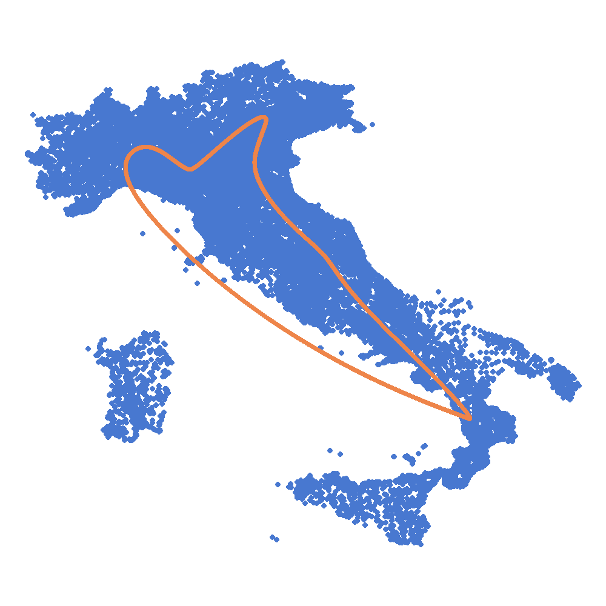

# Solving the Traveling Salesman Problem using Self-Organizing Maps
**Author**: Daniel García Peña  
**Email**: info@iamdgarcia.com

This repository provides an implementation of a Self-Organizing Map (SOM) tailored for finding sub-optimal solutions to the Traveling Salesman Problem (TSP). The program supports `.tsp` files, a common format used for this problem. The source code is located in the `src` directory. For a detailed explanation of the implementation and evaluation, you can read [this blog post]().



## Requirements

To run this code, you need Python 3 along with `matplotlib`, `numpy`, and `pandas`. These are included in the Anaconda distribution by default. If you're not using Anaconda, you can install the dependencies with:

```sh
pip install -r requirements.txt
```

## How to Run

To execute the code, use the following commands:

```sh
cd som-python
python src/main.py assets/<instance>.tsp
```

Generated images will be saved in the `results` folder. If you wish to create an animation from these images, you can use a tool like `convert`:

```sh
convert -delay 10 -loop 0 *.png tmp.gif
```

## License

This project is licensed under the MIT License, allowing you to freely modify and use the code in your own projects. For questions or contributions, feel free to reach out or open an issue in this repository.

---